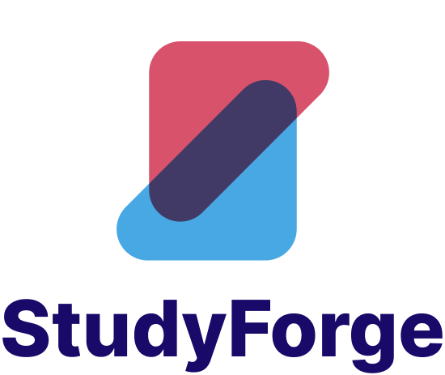

<a name="readme-top"></a>


<!-- PROJECT LOGO -->
<br />
<div align="center">
  <a href="https://github.com/pelu-mi/StudyForge">
    
  </a>

  <h3 align="center">StudyForge</h3>

  <p align="center">
    Enhance your Learning Experience!
    <br />
    <a href="https://github.com/pelu-mi/StudyForge"><strong>Explore »</strong></a>
    <br />
    <br />
    <a href="https://github.com/pelu-mi/StudyForge">View Demo</a>
    ·
    <a href="https://github.com/pelu-mi/StudyForge/issues/new?labels=bug&template=bug-report---.md">Report Bug</a>
    ·
    <a href="https://github.com/pelu-mi/StudyForge/issues/new?labels=enhancement&template=feature-request---.md">Request Feature</a>
  </p>
</div>


<!-- TABLE OF CONTENTS -->
<details>
  <summary>Table of Contents</summary>
  <ol>
    <li>
      <a href="#about-the-project">About The Project</a>
      <ul>
        <li><a href="#built-with">Built With</a></li>
      </ul>
    </li>
    <li>
      <a href="#getting-started">Getting Started</a>
      <ul>
        <li><a href="#prerequisites">Prerequisites</a></li>
        <li><a href="#installation">Installation</a></li>
      </ul>
    </li>
    <li><a href="#usage">Usage</a></li>
    <li><a href="#roadmap">Roadmap</a></li>
    <li><a href="#license">License</a></li>
    <li><a href="#authors">Authors</a></li>
    <li><a href="#acknowledgments">Acknowledgments</a></li>
  </ol>
</details>


<!-- ABOUT THE PROJECT -->
## About The Project

<!-- [![Product Name Screen Shot][product-screenshot]](https://example.com) -->
Being a student in a modern day society is not the same as it used to be. Resources are now more readily available than ever before. A simple google search today can provide a student with more information than a student 50 years ago could find alone in a day.

With the amount of information available and the ease with which the information is available, it would be easy to assume that studying is easier than ever before. 

But the real question is “How do we make the best of the resources we have access to?”. Over the years, there have been various attempts to answer this question, most prominently, with the rise of e-learning platforms.

With this project, the goal was to leverage modern day Large Language Models (LLMs) to create more adaptable study resources for individuals which would in turn, create a more engaging learning experience for students, essentially supporting effective study habits. The core functionality implemented to satisfy this goal includes:

 - [x] **User Signup & Login**: Users are able to share one profile across multiple devices by creating an account and logging in to the same account across all their devices
 - [x] **Dashboard**: This acts as a central hub for all the features in the application. Here, an overview of the user’s account is provided for the user, showing key summary information such as the number of generated resources, number of created study alerts, number of quizzes and also provides users with the most recent quizzes and study alerts.
 - [x] **Study Resource Generation (Forge)**: Here, the user is able to generate study materials by either uploading a file or using a text prompt. This input along with the additional information provided is then used to create a study resource for the user.
 - [x] **Resource Page**: This page allows the user to interact with the generated study resource. Each study resource contains 4 main categories: Source, Summary, Key Concepts and Quizzes.
 - [x] **Resource management (Library)**: This page provides the user with an interface allowing for the user to see all the resources generated as well as key information about each resource.
 - [x] **Profile**: This page provides the user with their information and also acts as a hub of all personalization features for the user such as change password, change user name or change app theme.
 - [x] **Study Alerts**: This feature allows users to schedule multiple alerts that are delivered in the form of an email notification to the user at the specified time.
 - [x] **Theme (Light/Dark mode)**: At first, the app color theme is initialized by the system-enabled theme. However, the user has the ability to change the color theme from light to dark mode which can enhance user comfort and accessibility.
 - [x] **Delete Study Alert, Resource & Account**: The user has the option to delete study alerts, Resources and also their account if they decide they want to. To be successfully carried out, each action first provides the user with the choice to cancel or confirm the action about to take which helps prevent accidental deletion.
 - [x] **Change Password**: Users can decide to change their password if they are not satisfied with what they have set it to be.

To successfully implement this, we employed the use of the MERN stack. MongoDB Atlas is the interface with which we use to interact with our MongoDB instance. The server was built using ExpressJS and NodeJS. The interface was built using React Native and Vite also aided in speeding up the process of development. 


This is the MVP created after the first development sprint. 

<p align="right">(<a href="#readme-top">back to top</a>)</p>


## Built With

Technologies employed to build this application include:

* 
* 
* 
* 
* 
* 
* 
* 

<p align="right">(<a href="#readme-top">back to top</a>)</p>


<!-- GETTING STARTED -->
## Getting Started

This project was built to run locally. To get a local copy up and running, follow the steps below.

### Prerequisites

To ensure you have no difficulty running this application, be sure to have the following installed:

* npm (latest version)
  ```sh
  npm install npm@latest -g
  ```

### Installation

To install the application, simply follow these steps:

1. Clone the repo
   ```sh
   git clone https://github.com/pelu-mi/StudyForge.git
   ```
2. Install NPM packages
   ```sh
   cd client && npm install
   cd ../server && npm install
   ```
3. Initialize environment Variables


<p align="right">(<a href="#readme-top">back to top</a>)</p>


<!-- USAGE -->
## Usage

To run the application, you will need to open 2 terminal windows, one in the `client` directory and the other in the `server` directory. 

In each window, run this command

```sh
   npm run start
   ```


<p align="right">(<a href="#readme-top">back to top</a>)</p>


<!-- ROADMAP -->
## Roadmap

_Moving forward_
- [ ] Vector Embeddings
- [ ] Dynamic Resources
- [ ] Community Features
- [ ] Global library


<!--
- [x] Add Changelog
- [x] Add back to top links
- [ ] Add Additional Templates w/ Examples
- [ ] Add "components" document to easily copy & paste sections of the readme
- [ ] Multi-language Support
    - [ ] Chinese
    - [ ] Spanish
-->

<p align="right">(<a href="#readme-top">back to top</a>)</p>


<!-- LICENSE -->
## License

Distributed under the MIT License. 

See `LICENSE.txt` for more information.

<p align="right">(<a href="#readme-top">back to top</a>)</p>


<!-- CONTACT -->
## Authors

**James Kanin** - [@kaninnoothep](https://github.com/kaninnoothep) - [kaninnoothep@gmail.com](mailto:kaninnoothep@gmail.com)

**Emmanuel Aimuel** - [@Daxtterr](https://github.com/Daxtterr) - [aimuelemmanuel@gmail.com](mailto:aimuelemmanuel@gmail.com)

**Oluwapelumi Fadolapo** - [@pelu-mi](https://github.com/pelu-mi) - [pelumifadolapo7@gmail.com](mailto:pelumifadolapo7@gmail.com)

================================================================

**Project Link**: [https://github.com/pelu-mi/StudyForge](https://github.com/pelu-mi/StudyForge)

<p align="right">(<a href="#readme-top">back to top</a>)</p>


<!-- ACKNOWLEDGMENTS -->
## Acknowledgments

Here are some resources we found useful during the process of building this application!

* [How to Use MERN Stack: A Complete Guide](https://www.mongodb.com/resources/languages/mern-stack-tutorial)
* [Getting started with Vite](https://vitejs.dev/guide/)
* [Your first component with Material UI](https://mui.com/material-ui/getting-started/learn/)
* [Get Started with React Native](https://reactnative.dev/)
* [Expo tutorial](https://docs.expo.dev/tutorial/introduction/)
* [Malven's Flexbox Cheatsheet](https://flexbox.malven.co/)
* [Malven's Grid Cheatsheet](https://grid.malven.co/)
* [Font Awesome](https://fontawesome.com)
* [React Icons](https://react-icons.github.io/react-icons/search)
* [Mongoose Documentation](https://mongoosejs.com/docs/)

<p align="right">(<a href="#readme-top">back to top</a>)</p>


